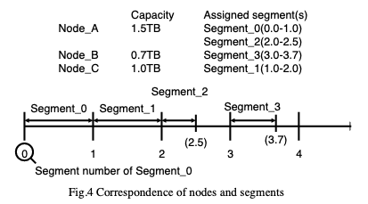

# ASURA

ASURA implementation in Rust.

## What is ASURA

**ASURA**, like best-known consistent-hashing, is an algorithm to compute the placement node from a key. ASURA is a abbreviation of Advanced Scalable
and Uniform storage by Random number Algorithm.

The basic: ASURA is a class of Monte Carlo method because it uses random number to choose the placement node. Nodes are mapped to segments (non-overlapping but allowing gaps) and it generates random numbers until hit one.

The core of the ASURA is ASURA random number generator. Because of the property, we can add or remove a node without changing most of the previous placements just like consistent-hashing.

For more detail, you can read the paper here: [https://arxiv.org/ftp/arxiv/papers/1309/1309.7720.pdf](https://arxiv.org/ftp/arxiv/papers/1309/1309.7720.pdf).
## Author

Akira Hayakawa (ruby.wktk@gmail.com)